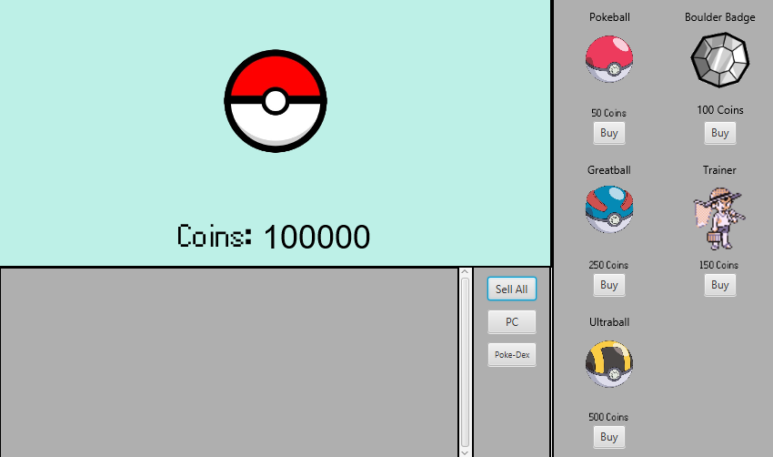
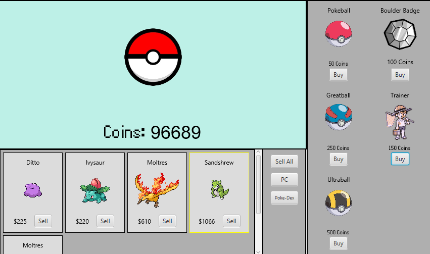

Pokémon Clicker (JavaFX)
========================

A simple Pokémon-themed clicker game built with JavaFX. Click the ball to earn coins, buy Poké Balls, badges, and trainers, and manage your inventory/PC storage.

Requirements
------------
- JDK 17
- Maven 3.8+
- JavaFX runtime (handled by the Maven JavaFX plugin in this project)

Screenshots
------------





Project Layout
--------------
- [src/main/java/javafx](src/main/java/javafx): Application code (Main, Controller, PC view, etc.).
- [src/main/java/api](src/main/java/api): API helpers.
- [src/main/java/javafx/fxml](src/main/java/javafx/fxml): FXML views and styling.
- [src/main/java/resources](src/main/java/resources): README and supporting resources.
- [src/test/java/javafx/PokeBallRollTest.java](src/test/java/javafx/PokeBallRollTest.java): Sample JUnit test.
- [pokemon.txt](pokemon.txt) and [pokemonShinys.txt](pokemonShinys.txt): Pokémon data files used by the game.

How to Run
----------
From the project root:

```
mvn javafx:run
```

If you have multiple Java installations, ensure `JAVA_HOME` points to JDK 17.

How to Test
-----------
Run all tests with Maven:

```
mvn test
```

Notes
-----
- Images and FXML are loaded from the classpath; no extra setup needed when using Maven.
- The game window title and main scene are configured in [src/main/java/javafx/Main.java](src/main/java/javafx/Main.java).


